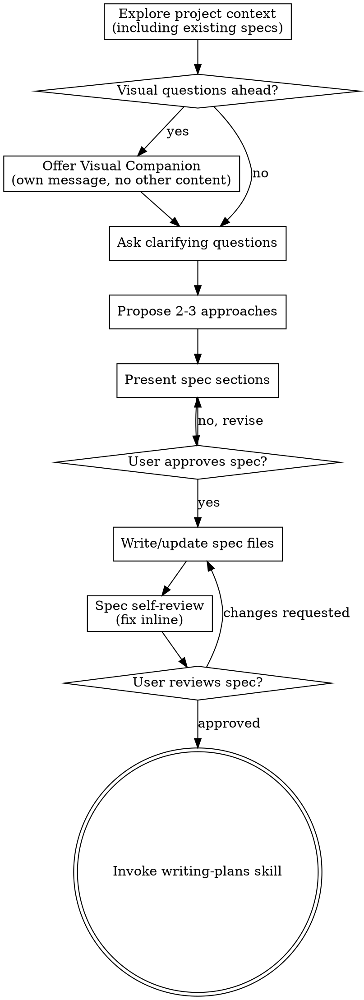

# Brainstorming Ideas Into Specs

Help turn ideas into fully formed, long-living specs through natural collaborative dialogue.

Start by understanding the current project context (including existing specs if any), then ask questions one at a time to refine the idea. Once you understand what you're building, present the spec and get user approval.

Specs are **living documents** that evolve with the project. They live as modular files (default: `docs/specs/`) and serve as the source of truth for what the project does and should do. If no specs directory exists, ask the user where specs should live before proceeding.

<HARD-GATE>
Do NOT invoke any implementation skill, write any code, scaffold any project, or take any implementation action until you have presented a spec and the user has approved it. This applies to EVERY project regardless of perceived simplicity.
</HARD-GATE>

## Anti-Pattern: "This Is Too Simple To Need A Spec"

Every project goes through this process. A todo list, a single-function utility, a config change — all of them. "Simple" projects are where unexamined assumptions cause the most wasted work. The spec can be short (a few sentences for truly simple projects), but you MUST present it and get approval.

## Spec Structure

```
docs/specs/
├── index.md              # Project overview, links to all spec files
├── architecture.md       # High-level architecture, tech stack, key decisions
├── <module-a>.md         # Per-module/domain spec
├── <module-b>.md         # ...
└── ...
```

**Rules:**
- **Specs are high-level** — describe *what* and *why*, not *how*. Include types, interfaces, and contracts but never implementation code. Implementation details belong in plans, not specs.
- Each file stays under ~300 lines (forces decomposition)
- `index.md` is always the entry point — lists all spec files with one-line descriptions
- `architecture.md` covers system-wide concerns: data flow, deployment, dependencies, constraints
- Module files cover the specific domain: purpose, interfaces, behavior, edge cases
- File naming: lowercase-kebab-case matching the domain/module name
- Cross-reference via links between spec files, never duplicate content
- Guideline: ~1k lines of spec per 10k lines of code

## Checklist

You MUST create a task for each of these items and complete them in order:

1. **Explore project context deeply** — go through files, docs, recent commits, and intricacies of the codebase. Look for existing specs (check `docs/specs/` or other likely locations). If no specs directory exists, ask the user where specs should live (default: `docs/specs/`). If specs exist, read them as foundational context.
2. **Offer visual companion** (if topic will involve visual questions) — this is its own message, not combined with a clarifying question. See the Visual Companion section below.
3. **Ask clarifying questions** — one at a time, understand purpose/constraints/success criteria
4. **Propose 2-3 approaches** — with trade-offs and your recommendation
5. **Present spec sections** — incrementally, get user approval after each section
6. **Write/update spec files** — create or update files in `docs/specs/`, cross-reference via links, and commit
7. **Spec self-review** — quick inline check for placeholders, contradictions, ambiguity, scope (see below)
8. **User reviews written spec** — ask user to review the spec file before proceeding
9. **Transition to implementation** — invoke writing-plans skill to create implementation plan, communicating what changed in the specs

## Process Flow



**The terminal state is invoking writing-plans.** Do NOT invoke frontend-design, mcp-builder, or any other implementation skill. The ONLY skill you invoke after brainstorming is writing-plans.

## The Process

**Understanding the idea:**

- Look for existing specs (`docs/specs/` or other locations). If none found, ask the user where specs should live (default: `docs/specs/`)
- If specs exist, read them deeply — they are foundational context for any change
- Go through the current project state in detail: files referenced in the relevant specs, recent commits
- Before asking detailed questions, assess scope: if the request describes multiple independent subsystems (e.g., "build a platform with chat, file storage, billing, and analytics"), flag this immediately. Don't spend questions refining details of a project that needs to be decomposed first.
- If the project is too large for a single spec, help the user decompose into sub-projects: what are the independent pieces, how do they relate, what order should they be built? Then brainstorm the first sub-project through the normal design flow. Each sub-project gets its own spec → plan → implementation cycle.
- For appropriately-scoped projects, ask questions one at a time to refine the idea
- Prefer multiple choice questions when possible, but open-ended is fine too
- Only one question per message - if a topic needs more exploration, break it into multiple questions
- Focus on understanding: purpose, constraints, success criteria

**Exploring approaches:**

- Propose 2-3 different approaches with trade-offs
- Present options conversationally with your recommendation and reasoning
- Lead with your recommended option and explain why

**Presenting the spec:**

- Once you believe you understand what you're building, present the spec
- Scale each section to its complexity: a few sentences if straightforward, up to 200-300 words if nuanced
- Ask after each section whether it looks right so far
- Cover: architecture, components, data flow, error handling, testing
- Be ready to go back and clarify if something doesn't make sense

**Design for isolation and clarity:**

- Break the system into smaller units that each have one clear purpose, communicate through well-defined interfaces, and can be understood and tested independently
- For each unit, you should be able to answer: what does it do, how do you use it, and what does it depend on?
- Can someone understand what a unit does without reading its internals? Can you change the internals without breaking consumers? If not, the boundaries need work.
- Smaller, well-bounded units are also easier for you to work with - you reason better about code you can hold in context at once, and your edits are more reliable when files are focused. When a file grows large, that's often a signal that it's doing too much.

**Working in existing codebases:**

- Explore the current structure before proposing changes. Follow existing patterns.
- Where existing code has problems that affect the work (e.g., a file that's grown too large, unclear boundaries, tangled responsibilities), include targeted improvements as part of the spec - the way a good developer improves code they're working in.
- Don't propose unrelated refactoring. Stay focused on what serves the current goal.

**Writing style — thorough but concise:**
- Every sentence must earn its place — if it doesn't add information a developer needs, cut it
- State behavior and constraints directly, don't narrate or explain why something is obvious
- Use bullet points and tables over prose where possible
- Prefer concrete examples over abstract descriptions (e.g. "returns `{error: "not_found"}` on 404" not "returns an appropriate error response")
- Name exact types, endpoints, fields, and files — vague specs produce vague implementations
- Include types and interfaces to define contracts between components — but never implementation code. Specs define the *shape*, plans provide the *code*.
- Omit filler: "It should be noted that", "In order to", "The system will need to" — just state the fact
- If a section is mostly boilerplate, it probably doesn't need to exist

## After the Spec

**Documentation:**

- Write or update spec files in the specs directory (as determined earlier)
- Create `index.md` if it doesn't exist, or update it to reference new spec files
- Cross-reference between spec files via links — never duplicate content
- Use elements-of-style:writing-clearly-and-concisely skill if available
- Commit the spec files to git

**Spec Self-Review:**
After writing the spec document, look at it with fresh eyes:

1. **Placeholder scan:** Any "TBD", "TODO", incomplete sections, or vague requirements? Fix them.
2. **Internal consistency:** Do any sections contradict each other? Does the architecture match the feature descriptions?
3. **Scope check:** Is this focused enough for a single implementation plan, or does it need decomposition?
4. **Ambiguity check:** Could any requirement be interpreted two different ways? If so, pick one and make it explicit.

Fix any issues inline. No need to re-review — just fix and move on.

**User Review Gate:**
After the spec review loop passes, ask the user to review the written spec before proceeding:

> "Spec written and committed to `<path>`. Please review it and let me know if you want to make any changes before we start writing out the implementation plan."

Wait for the user's response. If they request changes, make them and re-run the spec review loop. Only proceed once the user approves.

**Implementation:**

- Invoke the writing-plans skill to create a detailed implementation plan
- Communicate what changed in the specs so the plan covers the delta
- Do NOT invoke any other skill. writing-plans is the next step.

## Key Principles

- **One question at a time** - Don't overwhelm with multiple questions
- **Multiple choice preferred** - Easier to answer than open-ended when possible
- **YAGNI ruthlessly** - Remove unnecessary features from all specs
- **Explore alternatives** - Always propose 2-3 approaches before settling
- **Incremental validation** - Present spec, get approval before moving on
- **Be flexible** - Go back and clarify when something doesn't make sense
- **No duplication** - Cross-reference between spec files via links
- **Living documents** - Specs evolve with the project, they are not one-off artifacts
- **Thorough but concise** - Every line should inform implementation. Cut filler, be specific, use concrete examples

## Visual Companion

A browser-based companion for showing mockups, diagrams, and visual options during brainstorming. Available as a tool — not a mode. Accepting the companion means it's available for questions that benefit from visual treatment; it does NOT mean every question goes through the browser.

**Offering the companion:** When you anticipate that upcoming questions will involve visual content (mockups, layouts, diagrams), offer it once for consent:
> "Some of what we're working on might be easier to explain if I can show it to you in a web browser. I can put together mockups, diagrams, comparisons, and other visuals as we go. This feature is still new and can be token-intensive. Want to try it? (Requires opening a local URL)"

**This offer MUST be its own message.** Do not combine it with clarifying questions, context summaries, or any other content. The message should contain ONLY the offer above and nothing else. Wait for the user's response before continuing. If they decline, proceed with text-only brainstorming.

**Per-question decision:** Even after the user accepts, decide FOR EACH QUESTION whether to use the browser or the terminal. The test: **would the user understand this better by seeing it than reading it?**

- **Use the browser** for content that IS visual — mockups, wireframes, layout comparisons, architecture diagrams, side-by-side visual designs
- **Use the terminal** for content that is text — requirements questions, conceptual choices, tradeoff lists, A/B/C/D text options, scope decisions

A question about a UI topic is not automatically a visual question. "What does personality mean in this context?" is a conceptual question — use the terminal. "Which wizard layout works better?" is a visual question — use the browser.

If they agree to the companion, read the detailed guide before proceeding:
`skills/brainstorming/visual-companion.md`
