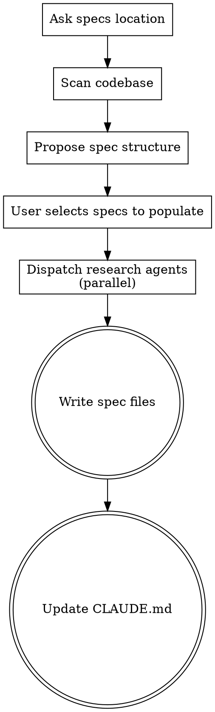

# Initialize Project Specs

## Overview

Bootstrap the specs structure for an existing project by asking where specs should live, scanning the codebase, proposing a spec structure, and populating selected specs through agent-driven research.

This skill documents **what the code does today**, not aspirational features. Use the brainstorming skill to evolve specs with new ideas after initialization.

**Announce at start:** "I'm using the init-specs skill to bootstrap project specifications."

## When to Use

- Project has code but no specs directory
- Existing specs don't follow the expected structure (missing index.md, no cross-references, wrong file organization)
- User wants to regenerate or restructure existing specs
- User wants to document an existing codebase before evolving it
- Starting to use the spec-driven workflow on an existing project

## Checklist

You MUST create a task for each of these items and complete them in order:

1. **Ask specs location** — ask the user where specs should live (default: `docs/specs/`)
2. **Scan the codebase deeply** — go through project structure, key modules, dependencies, configuration, tests, and intricacies of the codebase. If specs already exist at the chosen location, read them to understand current state.
3. **Propose spec structure** — present the user with a proposed list of spec files, noting which already exist and what needs to change
4. **User selects which specs to populate** — user picks which specs should be researched and filled in
5. **Research and populate** — dispatch agents to deeply explore relevant code, including intricacies, and produce specs
6. **Write spec files** — write specs to the chosen location
7. **Update CLAUDE.md** — add or update a section describing the specs directory, its purpose, and the instruction to read the specs index before any task

## Process Flow



## The Process

### Step 1: Ask Specs Location

Use `AskUserQuestion` to ask where specs should live. Default to `docs/specs/`. Use the chosen path (referred to as `<specs-dir>` below) for all subsequent steps.

### Step 2: Scan the Codebase

Explore the project deeply:
- Project structure and directory layout
- Key modules and their responsibilities
- Dependencies and tech stack
- Configuration files
- Test structure and coverage
- Entry points and interfaces
- Data flow between components

If `<specs-dir>` already exists, also review:
- Which spec files exist and what they cover
- Whether the structure follows the expected format (index.md, architecture.md, per-module files)
- Whether cross-references and links are in place
- What content is accurate vs outdated vs missing

### Step 3: Propose Spec Structure

Present the user with a proposed spec layout:

```
<specs-dir>/
├── index.md              # Project overview
├── architecture.md       # High-level architecture
├── <module-a>.md         # Identified module/domain
├── <module-b>.md         # ...
└── ...
```

For each proposed file, include:
- A one-line description of what it would cover
- Which parts of the codebase it maps to
- Whether it already exists and what would change (if restructuring)

Use `AskUserQuestion` with multi-select to let the user choose which specs to populate or regenerate.

### Step 4: Research and Populate

For each selected spec, dispatch an agent to:
- Deeply explore the relevant code paths
- Document purpose, interfaces, behavior, edge cases — stay high-level. Include types and interfaces to define contracts, but no implementation code.
- Identify cross-references to other spec files (use links, don't duplicate)

Use `dispatching-parallel-agents` when multiple specs are selected — each agent researches one spec independently.

### Step 5: Write Spec Files

- Create `<specs-dir>` directory if it doesn't exist
- Write all spec files (replacing existing ones when regenerating)
- Ensure `index.md` links to all spec files with one-line descriptions
- Cross-reference between files via links — never duplicate content
- Each file stays under ~300 lines
- Commit all spec files to git

### Step 6: Update CLAUDE.md

Add or update a section in the project's `CLAUDE.md` that describes the specs, using the actual chosen `<specs-dir>` path:

```markdown
## Project Specs

This project maintains living specifications in `<specs-dir>/`.

**Before starting any task, read `<specs-dir>/index.md`** to understand the project structure and find relevant specs.

Specs are the source of truth for what the project does and should do. They are high-level: they describe *what* and *why*, and may include types or interfaces to define contracts, but never implementation code. They are organized as:
- `index.md` — project overview and links to all spec files
- `architecture.md` — high-level architecture, tech stack, key decisions
- Per-module files — domain-specific specs covering purpose, interfaces, behavior, and edge cases

When modifying the project, ensure changes align with the relevant specs. If specs need updating, use the brainstorming skill to evolve them first.
```

If `CLAUDE.md` doesn't exist, create it with this section. If it exists, add or replace the `## Project Specs` section. Commit the change.

## Spec File Guidelines

- **High-level only**: Specs describe *what* and *why*, not *how*. Include types, interfaces, and contracts to define boundaries — but never implementation code. Implementation belongs in plans, not specs.
- **index.md**: Project overview, purpose, links to all other spec files with one-line descriptions
- **architecture.md**: System-wide concerns — tech stack, data flow, deployment, dependencies, constraints, key architectural decisions
- **Module files**: Domain-specific — purpose, interfaces, behavior, edge cases, relevant configuration
- **File naming**: lowercase-kebab-case matching the domain/module name
- **Cross-references**: Link between spec files, never duplicate content
- **Size limit**: ~300 lines per file (forces decomposition)
- **Guideline**: ~1k lines of spec per 10k lines of code

## Key Principles

- **The user chooses what to document** — propose structure, user selects which modules to spec
- **Document what exists, not what should exist** — specs describe current reality
- **Cross-reference, don't duplicate** — each fact lives in one spec file
- **Parallel research** — dispatch agents concurrently for independent specs
